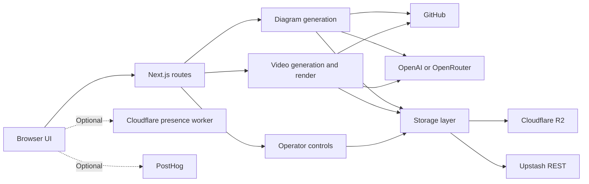

# Application architecture

The Next.js app contains the browser UI and the server routes.
The server reads GitHub, sends bounded repository context to a model, and saves results.
The optional Cloudflare Worker holds live browser connections for the operator dashboard.

## Runtime parts

`POST` in `src/app/api/generate/stream/route.ts:126` coordinates diagram work and sends server-sent events.
`getGithubData` in `src/server/generate/github.ts:583` reads repository metadata, tree, and README.
`createClient` in `src/server/generate/openai.ts:48` selects OpenAI or OpenRouter.
`persistGenerationResult` in `src/server/storage/generation-persistence.ts:30` saves the terminal result.

`generateExplainerVideo` in `src/server/explainer/generate.ts:25` makes a video plan, narration, and stored artifact.
`renderMp4InSegments` in `src/server/explainer/segments.ts:332` coordinates MP4 rendering.
The render worker uses Chromium and ffmpeg through `renderVideoSegment` in `src/server/explainer/render.ts`.

`POST` in `src/app/api/admin/controls/route.ts:37` writes operator controls.
The presence Worker uses the `Presence` object in `workers/presence/src/index.ts` for live connections and events.
`captureAnalyticsEvent` in `src/lib/analytics-client.ts:112` sends optional browser events to PostHog.

## State and deployment

`getPublicLocation` and `getPrivateLocation` in `src/server/storage/cache-key.ts` select different R2 buckets.
The private location also uses a namespace from the caller's GitHub token.
`upstashCommand` in `src/server/storage/upstash.ts:52` sends Redis commands for quota and coordination state.
`videoStoreBackend` in `src/server/explainer/store.ts:77` selects local storage when production is off and R2 in production.

`package.json` gives Bun development and build commands.
`Dockerfile` assembles a standalone Next.js image with Chromium for local container deployment.
`next.config.js` sets the browser CSP and the presence connection origin.
The [deployment recovery page](deployment-failover.md) gives the Railway recovery path kept in this repository.
