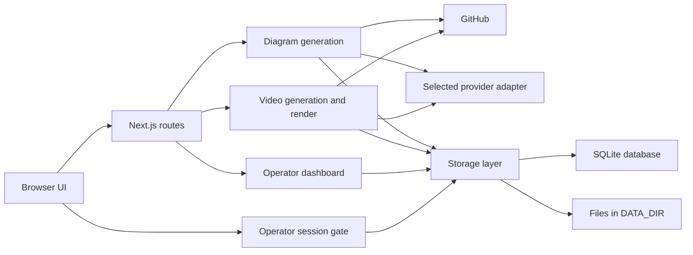

# Application architecture

The Next.js app contains the browser UI and the server routes.
The server reads GitHub, sends bounded repository context to a model, and saves results on local disk.
The browser makes requests to its own origin only. The CSP `connect-src` value is `'self'`.
The app has one operator. It has no public admission rules, per-person budgets, or geographic rules.

## Runtime parts

`POST` in `src/app/api/generate/stream/route.ts:116` coordinates diagram work and sends server-sent events.
`createGenerationSseWriter` in `src/server/generate/sse-writer.ts` batches and pads stream events when `SSE_FLUSH_PAD_BYTES` is above zero.
`getGithubData` in `src/server/generate/github.ts:613` reads repository metadata, tree, and README.
`createGenerationProvider` in `src/server/ai/create-provider.ts` selects the configured adapter for diagram generation.

`GenerationProvider` in `src/server/ai/provider.ts` has text streams, structured output, and optional input token counts.
`getProvider` in `src/server/generate/model-config.ts` accepts five providers. The route uses OpenAI Responses, Anthropic Messages, or OpenAI Chat through the adapters.

The pricing lookup uses the selected provider and model. The current rate table covers OpenAI models.
The stream and cost routes continue when a model has no known price. The cost summary keeps token counts and reports USD cost as `n/a`.
`persistGenerationResult` in `src/server/storage/generation-persistence.ts:31` saves the terminal result.

`generateExplainerVideo` in `src/server/explainer/generate.ts:26` makes a video plan, narration, and stored artifact.
`renderMp4InSegments` in `src/server/explainer/segments.ts:327` coordinates MP4 rendering.
The render worker uses Chromium and ffmpeg through `renderVideoSegment` in `src/server/explainer/render.ts`.

`readAdminState` in `src/server/admin/state.ts:41` reads the voice pause and the voice balance for the operator dashboard. The dashboard has no live control.

`AppProviders` in `src/app/providers.tsx` only operates `migrateLegacyCredentialStorage`. The app has no analytics provider.

## State

`DATA_DIR` is one folder that holds all saved state. `getDataDir` in `src/server/storage/db.ts:65` reads it and gives an error when it has no value.
The folder holds the SQLite database `gitdiagram.db`, and the folders `objects`, `video`, and `tmp`.
`getDb` in `src/server/storage/db.ts:141` opens the database with the built-in `node:sqlite` module.
The database holds locks, rows that can expire, the video gallery index, and the paid-run count. The app does not use the `controls` table.

The [artifact storage flow](flows/artifact-storage.md) shows each table and the file layout.

`getPublicLocation` and `getPrivateLocation` in `src/server/storage/cache-key.ts` select the `public` or `private` folder in `objects`.
The private location also uses a namespace from the caller's GitHub token.
`videoVersion` and `writeVideo` in `src/server/explainer/store.ts` keep video files in `DATA_DIR/video`.
The video store has one backend, which is local disk.

`GET` in `src/app/api/healthz/route.ts:14` answers `/api/healthz` with no operator gate. An anonymous caller gets only `ok`. A caller with a session also gets the four checks from `checkReadiness` in `src/server/readiness.ts:65`. It validates provider values before it checks local storage.

## Operator access

`proxy` in `src/proxy.ts` checks a signed operator session before a page or API route gets the request. The sign-in page and session API work without a session.
The operator uses those paths to start or end a session.

`verifyAdminSession` in `src/server/auth/operator.ts` checks the cookie signature, expiry, installation nonce, and generation in SQLite. The nonce identifies one database.
A cookie from before database deletion does not work after the app makes a new database.

`checkSignIn` in `src/server/auth/sign-in-guard.ts` records incorrect token tries in SQLite. The function stops sign-in when SQLite is unavailable. It writes one Warning event, `auth.sign_in.blocked`, for each lock window.
Sensitive route handlers also use `requireOperator` in `src/server/auth/require-operator.ts`. Only a session cookie gives access, and a Bearer token is ignored. The segment renderer uses its own signed HMAC token.

## Crawlers and hosting

`robots` in `src/app/robots.ts` disallows all paths, and the app has no sitemap. The root layout sets `robots` metadata to `index: false`.
The root layout sends no request to GitHub for a star count, and the app shows no star reminder.

`next.config.js` sets the browser CSP and always sets `output: "standalone"`. The build makes a self-contained `server.js` in `.next/standalone`.
`outputFileTracingExcludes` in `next.config.js` keeps the `src` folder out of the output. Without it, the video routes put their test files in the package.
`outputFileTracingIncludes` adds the `ffmpeg-static` binary to the video routes.

`scripts/package-iis.ps1` makes a zip of the standalone folder with `public`, `.next/static`, `web.config`, and `App_Data/logs`. It removes all `.env*` files. The command `bun run package:iis` starts it.

The target host is IIS on SmarterASP.NET. `httpPlatformHandler` starts `node server.js` as `deploy/iis/web.config` sets.
Production operates on Node.js, not Bun. Bun gives the development and build commands in `package.json`.
The repository has no Vercel, Railway, or Docker files, and the code reads no `VERCEL_*` key.

[Deploy to the IIS host](deployment.md) gives the steps. [ADR 0003](decisions/0003-self-hosted-single-operator.md) gives the causes.
