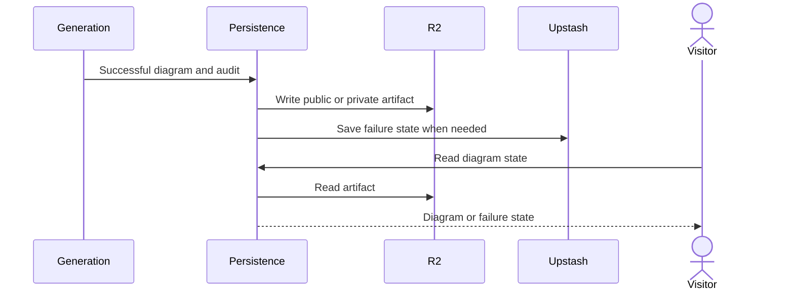

# Diagram artifact storage

## Purpose

This flow saves a completed diagram so a visitor can open it again.
It keeps public and private results in different R2 locations.

## Entry points

`persistGenerationResult` in `src/server/storage/generation-persistence.ts:30` processes the terminal generation result.
`getDiagramStateRecord` in `src/server/storage/diagram-state.ts:34` reads saved diagram or failure state.
`POST` in `src/app/api/diagram-state/route.ts:27` supplies state to the browser.

## Sequence

## Key behavior

* `getPublicLocation` in `src/server/storage/cache-key.ts:41` uses the public R2 bucket.
* `getPrivateLocation` in `src/server/storage/cache-key.ts:56` uses the private bucket and a token-derived namespace.
* `persistGenerationResult` does not save a private result if the caller has no GitHub token.
* `saveSuccessfulDiagramState` in `src/server/storage/diagram-state.ts:108` saves diagram text, graph, explanation, and audit summary.
* Public success starts preview and browse-index work in `persistGenerationResult`.
* `getDiagramStateRecord` tries a stored artifact before it reads the failure state.

## Failure modes

`writeDiagramArtifact` in `src/server/storage/artifact-store.ts:240` can give an error if R2 or its lock is unavailable.
The browser can get an empty state if there is no saved artifact or failure state.
The public browse preview can give an error after an artifact write without removing the saved diagram.
