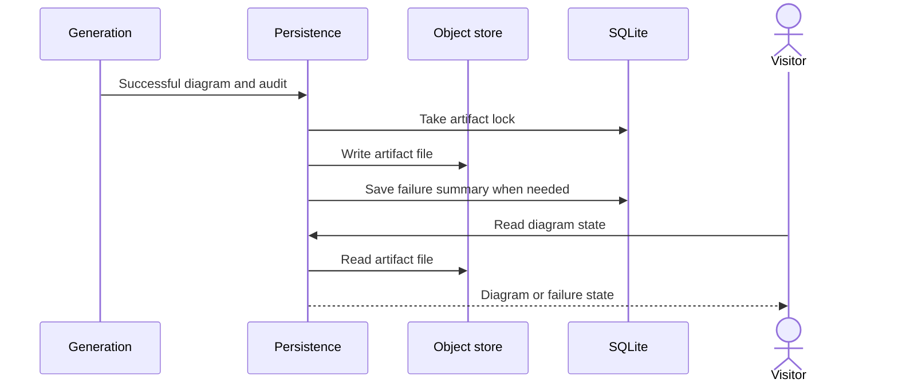

# Diagram artifact storage

## Purpose

This flow saves a completed diagram so a visitor can open it again.
It keeps public and private results in different folders in `DATA_DIR`.
SQLite and local files hold diagram and video state in `DATA_DIR`.

## Entry points

`persistGenerationResult` in `src/server/storage/generation-persistence.ts:31` processes the terminal generation result.
`getDiagramStateRecord` in `src/server/storage/diagram-state.ts:34` reads saved diagram or failure state.
`POST` in `src/app/api/diagram-state/route.ts:27` supplies state to the browser.

## Data layout

`getDataDir` in `src/server/storage/db.ts:65` gives the root folder from the `DATA_DIR` value. Each path below is relative to this folder.

| Path | Content |
| --- | --- |
| `gitdiagram.db` | The SQLite database. `getDb` opens it in WAL mode with a 5 second busy timeout. |
| `objects/public` | Public diagram artifacts, preview files, and the browse index files. |
| `objects/private` | Private diagram artifacts, in one folder for each token namespace. |
| `video/v1` | Explainer video files. See the [explainer video flow](explainer-video.md). |
| `tmp` | Temporary `.part` files that stay only until an atomic rename. |

`SCHEMA_VERSION` in `src/server/storage/db.ts:55` is 2. Each migration operates in a `BEGIN IMMEDIATE` transaction and sets `user_version`.
The app refuses to open a database with a newer schema version.

| Table | Migration | Content |
| --- | --- | --- |
| `locks` | 1 | One row for each held lock. `tryDistributedLock` and `withDistributedLock` use it. |
| `kv` | 1 | Small rows that can expire. Generation cancellation, failure summaries, the voice pause, and the video index flags use it. |
| `video_index` | 1 | One gallery card for each repository that has a video. |
| `paid_runs` | 2 | One row for each video that is in paid work. |
| `controls` | 2 | No code uses this table. The live controls are removed, and nothing reads or writes it. |

## Sequence

## Key behavior

* `getPublicLocation` in `src/server/storage/cache-key.ts:60` uses the `public` bucket. `getPrivateLocation` in `src/server/storage/cache-key.ts:75` uses the `private` bucket and a token-derived namespace.
* The two bucket names do not change. No environment value selects them.
* `persistGenerationResult` does not save a private result if the caller has no GitHub token.
* `saveSuccessfulDiagramState` in `src/server/storage/diagram-state.ts:108` saves diagram text, graph, explanation, and audit summary.
* `writeDiagramArtifact` in `src/server/storage/artifact-store.ts:235` holds an artifact lock while it reads the current artifact and writes the new one.
* `writeStored` in `src/server/storage/object-store.ts:130` checks the condition and writes in one `withImmediateTransaction`. It writes a temp file in `tmp` and renames it.
* A nested use of `withImmediateTransaction` in `src/server/storage/db.ts:196` uses the outer transaction. A callback error rolls back that transaction.
* `putGzipJsonObject` in `src/server/storage/object-store.ts:276` accepts an `ifMatch` or `ifNoneMatch` condition. A condition that the stored bytes do not agree with gives `ObjectPreconditionFailedError`.
* The etag of an object is the SHA-256 digest of its stored bytes.
* The browse index updates when a public diagram is saved. `upsertBrowseIndexEntry` in `src/server/storage/browse-diagrams.ts:450` writes the entry with its own lock and makes the index when none is there.
* The browse index has no drain route, no pending list, and no cron task.
* Only public diagrams go into the browse index. Before the first public diagram, `readBrowseIndex` in `src/server/storage/browse-diagrams.ts:219` gives an empty list, and the browse page shows no diagrams.
* A saved artifact clears the failure summary. A saved public artifact also starts a preview write.
* `getDiagramStateRecord` tries a stored artifact before it reads the failure state.
* `writeFailureSummary` in `src/server/storage/status-store.ts:55` saves the failure summary in the `kv` table. The summary expires after three days.

## Key rules

`isValidSegment` in `src/server/storage/fs-safety.ts:27` checks each bucket name and each segment of a key.
`toStorageSegment` in `src/server/storage/fs-safety.ts:45` makes a lowercase folder name from an owner or repository name.

* A key uses lowercase letters only. Windows sees uppercase and lowercase names as one name, so all keys use lowercase.
* A segment cannot be empty, `.`, or `..`. It cannot end with a dot or a space. It cannot contain a backslash, a control character, or one of `:<>"|?*`.
* `isWindowsDeviceName` in `src/server/storage/fs-safety.ts:17` rejects the names `con`, `prn`, `aux`, `nul`, `com0` to `com9`, and `lpt0` to `lpt9`. It rejects them with or without an extension.
* `objectPath` also checks that the resolved path stays in the bucket folder.
* `renameWithRetry` in `src/server/storage/fs-safety.ts:66` tries a rename five times, maximum, when Windows gives `EPERM`, `EBUSY`, or `EACCES`.

A repository with a Windows device name has no cached diagram.
`persistGenerationResult` records the storage error, and the diagram continues to the browser.

## Failure modes

`writeDiagramArtifact` can give an error if the database is busy for more than the lock wait time, or if a file write gives an error.
The browser can get an empty state if there is no saved artifact or failure state.
The public browse preview can give an error after an artifact write, but the saved diagram stays.
`getDb` gives an error if `DATA_DIR` has no value, if the folder does not accept writes, or if the schema is newer than the app.
