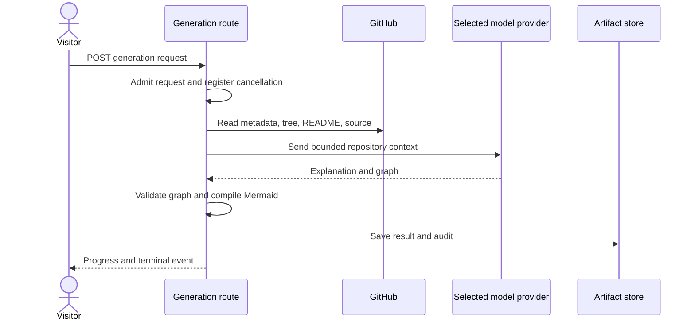

# Diagram generation

## Purpose

This flow makes a source-grounded architecture diagram for one GitHub repository.
The browser receives progress and a terminal result through server-sent events.

## Entry points

`Repo` in `src/app/[username]/[repo]/page.tsx` shows saved public state when it is available.
`useDiagram` in `src/hooks/useDiagram.ts` starts or refreshes generation from the browser.
`POST` in `src/app/api/generate/stream/route.ts:116` coordinates the server work.

## Sequence

## Key behavior

- `admitGenerationRequest` in `src/server/generate/request-admission.ts:42` checks input, credentials, and cancellation. It applies no daily quota and no rate limit.
- `getGithubData` in `src/server/generate/github.ts:613` reads repository metadata, the file tree, and README.
- `redactSecrets` in `src/server/generate/secret-scan.ts:253` changes secrets in text to `[REDACTED:<kind>]` markers and gives a count for each type of secret. It does not give a secret value.
- The scan finds private keys, provider keys and tokens, JWTs, connection string passwords, and high-entropy values in assignments that have a secret name. Keys with the `sk_test_` prefix stay in the text.
- `fetchSourceContext` in `src/server/generate/source-context.ts:147` scans the full text of each file with `redactSecrets` before `excerptSource` cuts an excerpt. A secret cannot be in two parts across an excerpt edge. `redactedSecretCount` is `0` when no source is available.
- `prepareRepositoryContext` in `src/server/generate/repository-context.ts:157` redacts the README after the length limit. It has its own `redactedSecretCount`.
- `POST` in `src/app/api/generate/stream/route.ts:116` adds the two counts in `redactedSecretCount` of the session audit. `withRedactedSecrets` in `src/server/generate/session-audit.ts` rejects a count that is negative or not an integer.
- `toStoredSessionSummary` in `src/server/storage/artifact-store.ts` keeps the count. The `generate.stream.finished` entry has it as `redacted_secret_count`. The count is a number and not a value.
- The scan is a filter and not a proof. A secret with an unknown format can go to the model provider.
- `redactLogText` in `src/server/log.ts:83` removes secrets from error text and from upstream response bodies before an entry in the server output holds them.
- `redactLogText` replaces the keys of the caller and the server keys from the environment. It also replaces the end of a key that an upstream shows with hidden characters. It applies the patterns of `redactSecrets`, and it removes `Bearer` tokens and `Authorization` header values. It redacts first and then cuts the text to the limit.
- `errorText` in `src/server/log.ts:123` applies `redactLogText` to an error message with a limit of 200 characters.
- `POST` in `src/app/api/generate/stream/route.ts:743` sends `raw_error` through `redactLogText` with the API key and the GitHub token of the caller. `POST` in `src/app/api/generate/cost/route.ts:187` does the same for `generate.cost.failed`. `fetchJsonResult` in `src/server/generate/github.ts:229` sends the body of a rejected GitHub response through `redactLogText`.
- The test `src/server/log-redaction.test.ts` stops the build when an entry in `src/server` or `src/app/api` has error text and no redaction.
- `createGenerationProvider` in `src/server/ai/create-provider.ts` selects an adapter for the configured provider and credentials.
- `GenerationProvider` in `src/server/ai/provider.ts` has text streams, structured output, and optional input token counts.
- `createOpenAIResponsesProvider` in `src/server/ai/openai-responses.ts`, `createAnthropicProvider` in `src/server/ai/anthropic.ts`, and `createOpenAIChatProvider` in `src/server/ai/openai-chat.ts` use this interface.
- `parseStructured` in `src/server/ai/openai-chat.ts:124` first asks for a strict JSON schema. If the endpoint refuses the schema with status 400, 404, or 422, the adapter tries again without the schema and puts the whole JSON Schema in the prompt. A refusal that names `response_format`, `json_schema`, structured output, or an invalid argument (Gemini) starts this fallback. The adapter reads JSON inside a Markdown code fence. It validates each answer, sends the path and the problem of up to five errors back to the model, and tries at most two more times.
- `POST` in `src/app/api/generate/stream/route.ts:116` uses `streamText` for explanation and `generateValidatedGraph` for structured graph output.
- `POST` in `src/app/api/generate/cost/route.ts:56` uses provider token counts when available. Other providers use `estimateTokens` in `src/server/generate/token-estimate.ts`.
- `estimateGenerationCost` in `src/server/generate/cost-estimate.ts` uses a local token estimate when a provider has no counter or its counter does not work.
- `resolvePricingModel` in `src/server/generate/pricing.ts` selects a known rate for the selected provider and model. The current rate table covers OpenAI models.
- Unknown and local model IDs have no USD rate. `createCostSummary` in `src/server/generate/pricing.ts` keeps token counts and sets `amountUsd` to `null` with display `n/a`.
- The stream and cost routes continue when a model has no known rate. They supply token counts with an `n/a` cost.
- `GenerationCostSummary` in `src/features/diagram/cost.ts` keeps `amountUsd` nullable so the UI can show token counts without a price.
- `usesSinglePassArchitecture` in `src/server/generate/model-config.ts` selects one architecture request for eligible OpenAI Luna models without an operator key. Other generations use an explanation request and graph planning.
- `GRAPH_REASONING_EFFORT` in `src/server/generate/generation-policy.ts` sets moderate effort for graph planning. The policy also sets prompt verbosity and estimated output token counts.
- `getSseFlushPadBytes` in `src/app/api/generate/stream/route.ts` reads `SSE_FLUSH_PAD_BYTES`. It defaults to `0` and accepts integer values from `0` to `65536`.
- `createGenerationSseWriter` in `src/server/generate/sse-writer.ts` batches events for at most 250 ms when padding is above zero. The writer appends an SSE comment with spaces. The comment pads the batch to the configured minimum or above.
- With padding enabled, `createGenerationSseWriter` sends a padded heartbeat each 15 seconds while the stream is idle. With padding disabled, `POST` sends an unpadded heartbeat at the same interval.
- `parseSSEChunk` in `src/features/diagram/sse.ts` reads only `data:` lines, so it ignores SSE comments.
- Set `SSE_FLUSH_PAD_BYTES` to `9216` in the host environment. The default `0` does not pad local or host streams.
- `registerActiveGeneration` in `src/server/generate/cancellation.ts:56` stores the active session in the SQLite `kv` table. The route polls it to find a cancel request.
- The cost route gives the estimate of the run. `graphRepairStaticInputTokens` in `src/server/generate/cost-estimate.ts` is always `null`, because the estimate does not count repair work.
- The session audit has no quota fields. `toStoredSessionSummary` in `src/server/storage/artifact-store.ts` drops the quota fields of earlier releases. The app can read an artifact that has them.

* `POST` in `src/app/api/generate/stream/route.ts:116` checks graph paths and makes Mermaid before it sends a terminal event.
* `sanitizeMermaidSourceForRender` and `enforceSafeMermaidLinks` in `src/features/diagram/mermaid-security.ts` let the browser use only GitHub URLs.

## Failure modes

`admitGenerationRequest` sends an error for invalid input, a cancellation session that is in progress, or an unavailable database.
`getGithubData` rejects a private repository when the caller has no GitHub token.
The generation route can stop on a deadline, cancellation, model error, graph error, or storage error.
A storage failure can keep a result in the current stream without a saved result for the next visit.
