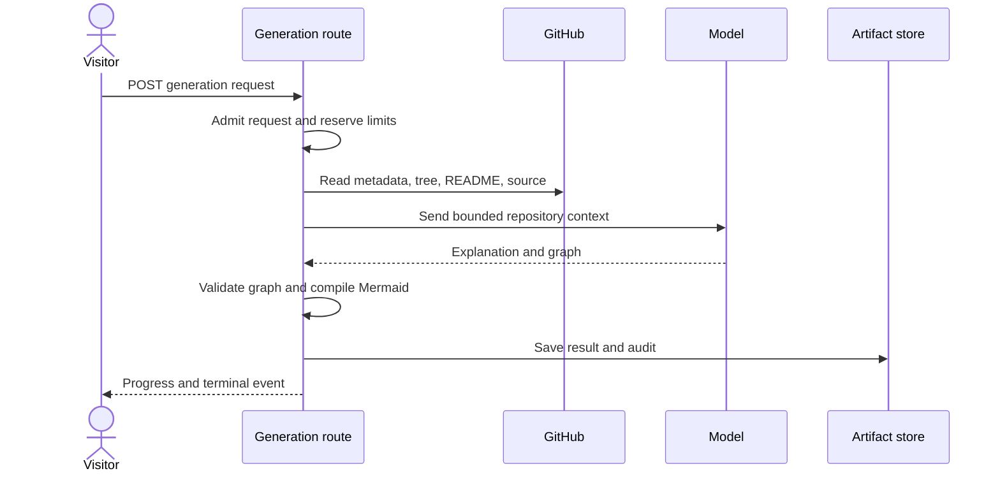

# Diagram generation

## Purpose

This flow makes a source-grounded architecture diagram for one GitHub repository.
The browser receives progress and a terminal result through server-sent events.

## Entry points

`Repo` in `src/app/[username]/[repo]/page.tsx` shows saved public state when it is available.
`useDiagram` in `src/hooks/useDiagram.ts` starts or refreshes generation from the browser.
`POST` in `src/app/api/generate/stream/route.ts:126` coordinates the server work.

## Sequence

## Key behavior

* `admitGenerationRequest` in `src/server/generate/request-admission.ts:65` checks input, credentials, limits, and cancellation.
* `getGithubData` in `src/server/generate/github.ts:583` reads repository metadata, the file tree, and README.
* `fetchSourceContext` in `src/server/generate/source-context.ts:129` reads bounded source excerpts.
* `createClient` in `src/server/generate/openai.ts:48` selects the model provider.
* `POST` in `src/app/api/generate/stream/route.ts` checks graph paths and makes Mermaid before it sends a terminal event.
* `sanitizeMermaidSourceForRender` and `enforceSafeMermaidLinks` in `src/features/diagram/mermaid-security.ts` let the browser use only GitHub URLs.

## Failure modes

`admitGenerationRequest` sends an error for invalid input or a denied rate limit.
`getGithubData` refuses a private repository without the caller's GitHub token.
The generation route can stop on a deadline, cancellation, model error, graph error, quota denial, or storage error.
A storage failure can keep a result in the current stream without a saved result for the next visit.
