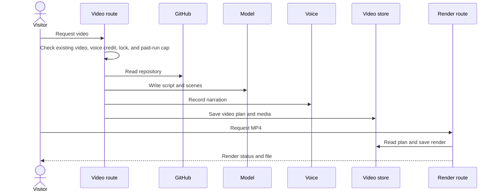

# Explainer video

## Purpose

This flow makes a narrated film about a public GitHub repository.
The browser can play the stored plan and get a rendered MP4 file.

## Entry points

`POST` in `src/app/api/video/generate/route.ts:98` checks admission and starts video generation.
`POST` in `src/app/api/video/render/route.ts:59` starts an MP4 render for a stored video. MP4 render is off by default. `VIDEO_RENDER_ENABLED=1` turns it on.
`GET` in `src/app/api/video/file/route.ts:87` sends posters, pictures, and MP4 downloads.

## Sequence

## Key behavior

* `isVideoExplainerEnabled` in `src/server/explainer/config.ts:7` checks the server video flag.
* `generateExplainerVideo` in `src/server/explainer/generate.ts:26` reads the repository and writes the video artifact.
* Scene design and narration operate in parallel after the script is complete.
* `isTrustedVideoCaller` in `src/server/explainer/limits.ts:25` accepts only a signed-in operator session cookie. It does not read an `Authorization` header.
* The request body of `POST` has `username`, `repo`, and an optional boolean `regenerate`. The body schema is strict, so other fields and other types give a 400 error.
* The route checks in this order: body, reserved names, stored video, voice credit, lock, and the stored video again after the lock.
* A stored video gives a 409 error with the code `exists` unless `regenerate` is `true`. With `regenerate` set, the route skips the check after the lock.
* `isNarrationAvailable` in `src/server/explainer/narration.ts` applies to the operator too. If the narrator has no credit, the route sends a 503 error with `pausedMessage` before the lock. Then the app does not pay for a script that it cannot voice.
* If the stored video cannot be read, the route sends a 503 error and no video starts.
* `GET` in `src/app/api/video/route.ts:57` reports `canGenerate: false` and `paused: "limit"` when the narrator has no credit or cannot be checked.
* `streamExplainerVideo` in `src/features/explainer/api.ts:131` sends `regenerate: true` only when its `options` have it. `startVideoRun` in `src/features/explainer/runs.ts:115` gives `options` to it.
* The Regenerate button sends the flag after the operator agrees. The Try again button sends it after a regeneration gives an error. The Make the video button does not send it.
* `tryPaidVideoRun` in `src/server/explainer/limits.ts:41` limits the videos in paid work at the same time to `VIDEO_MAX_PAID_RUNS`. The operator is counted but is not refused.
* `tryVideoLock` in `src/server/explainer/limits.ts:97` holds one lock for each repository. The lock and the paid-run cap apply in production only.
* The app has no daily budget, no per-person budget, no network budget, no audience rule, and no visitor cookie.
* `POST` rejects a repository name that is a Windows device name with a 400 error before paid work starts. It also rejects a name that `toStorageSegment` rejects.
* `writeVideo` in `src/server/explainer/store.ts:162` saves narration files and pictures first and the artifact last. Then it adds the gallery card and deletes stale files.
* The video store is local only. Video files are in `DATA_DIR/video/v1/<owner>/<repo>`, and a key uses `/` on all systems.
* `readVideoIndex` in `src/server/explainer/video-index.ts:91` reads the gallery cards from the `video_index` table.
* `listStoredVideos` in `src/server/explainer/store.ts:392` lets the app build the table from disk when the table is not complete.
* `streamRender` in `src/server/explainer/store.ts:245` streams an MP4 from disk. `parseRange` in `src/app/api/video/file/route.ts:57` answers one byte range with 206, and a range that is not possible with 416.
* The MP4 download does not redirect. The route sends `Accept-Ranges: bytes` and `Cache-Control: no-store`.
* `renderMp4InSegments` in `src/server/explainer/segments.ts:327` coordinates segment work for MP4 output.

## Failure modes

The generation route can reject a video mode that is off, a narrator with no credit, or a reserved repository name.
It can also reject a busy paid-run cap, a held lock, or a stored video without `regenerate`.
A paid failure is retryable, but a bad input or a model refusal is not. The app has no refund logic, because it has no daily budget.

`generateExplainerVideo` stops parallel work if scene design or narration gives an error.
The render route and the segment route give status 501 when render is off.
When render is off, the generation route makes no poster. `POST` in `src/app/api/video/generate/route.ts:101` logs `video.poster.render_disabled`.
The render route can reject a stale version or a held render lock.
Chromium, ffmpeg, segment work, or storage can give an error before an MP4 file is available.
