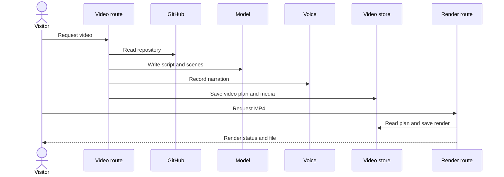

# Explainer video

## Purpose

This flow makes a narrated film about a public GitHub repository.
The browser can play the stored plan and get a rendered MP4 file.

## Entry points

`POST` in `src/app/api/video/generate/route.ts:130` checks admission and starts video generation.
`POST` in `src/app/api/video/render/route.ts:68` starts an MP4 render for a stored video.

## Sequence

## Key behavior

* `isVideoExplainerEnabled` in `src/server/explainer/config.ts:7` checks the server video flag.
* `generateExplainerVideo` in `src/server/explainer/generate.ts:25` reads the repository and writes the video artifact.
* Scene design and narration operate in parallel after the script is complete.
* `videoStoreBackend` in `src/server/explainer/store.ts:77` uses local files when production is off and R2 in production.
* `renderMp4InSegments` in `src/server/explainer/segments.ts:332` coordinates segment work for MP4 output.

## Failure modes

The generation route can refuse a disabled video mode, a new visitor, a paused audience, an exhausted limit, or a stored video.
`generateExplainerVideo` stops parallel work if scene design or narration gives an error.
The render route can refuse a stale version or an exhausted render limit.
Chromium, ffmpeg, segment work, or storage can give an error before an MP4 file is available.
