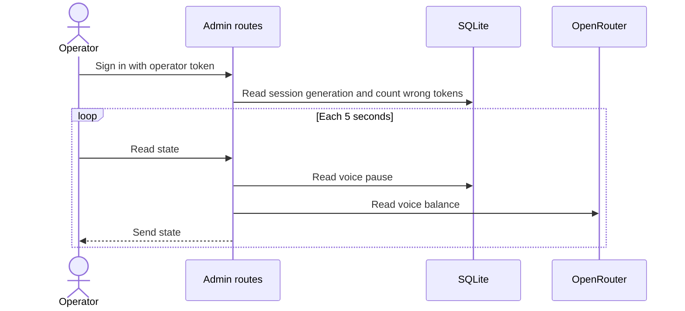

# Operator dashboard

## Purpose

This flow lets the operator sign in and read the voice balance on the `/admin` page.
The dashboard has one balance and no live control. It has no live visitor view, no daily budget tiles, and no button to clear counts.
The operator pause control and its route are removed. The voice-credit check and the paid-run cap limit the video cost without operator work.

## Entry points

`POST` in `src/app/api/auth/session/route.ts:46` signs in an operator.
`DELETE` in `src/app/api/auth/session/route.ts:104` ends one browser session or all browser sessions.
`SignInPage` in `src/app/sign-in/page.tsx:16` shows a token field with noindex metadata.
`proxy` in `src/proxy.ts:23` checks sessions before a page or API route gets a request.
`GET` in `src/app/api/healthz/route.ts:14` answers uptime checks without a session.
`GET` in `src/app/api/admin/state/route.ts:10` gives the polled dashboard state.

## Sequence

## Key behavior

* `isOperatorConfigured` in `src/server/auth/operator.ts:30` checks that the operator token has a length of 40 characters or more.
* `createAdminSession` in `src/server/auth/operator.ts:91` makes a browser session if SQLite can read the installation nonce and session generation.
* `installationNonce` in `src/server/auth/operator.ts:48` makes and stores the random nonce in SQLite on first use.
* `verifyAdminSession` in `src/server/auth/operator.ts:151` checks the cookie signature, expiry, installation nonce, and current generation.
* `revokeAdminSessions` in `src/server/auth/operator.ts:187` ends all browser sessions in a SQLite transaction.
* `safeNextPath` in `src/lib/safe-next-path.ts:2` accepts only a same-site relative path and rejects sign-in loop paths.
* `requireOperator` in `src/server/auth/require-operator.ts:10` checks for an operator session cookie on sensitive routes. The proxy checks these routes too.
* Only a session cookie gives access. The proxy and `requireOperator` do not read an `Authorization` header, so the app ignores a Bearer token. A Bearer token does not change the wrong-token counter.
* `GET` in `src/app/api/healthz/route.ts:14` is not in the proxy `config` path pattern. An anonymous caller gets `{ ok }` with status 200 or 503. A caller with a session also gets the `checks` object. The response is `no-store`.
* `readAdminState` in `src/server/admin/state.ts:41` reads the voice pause and the voice balance. It gives no deployment details.
* `readAdminState` reads each part on its own. A part that does not load shows as unreadable, and the others continue to show.
* The voice balance from OpenRouter has a 3 second deadline and a 30 second cache in `cachedVoiceCredit`.
* `useAdminState` in `src/app/admin/use-admin-state.ts` polls the state route at an interval of 5 seconds.

## Where the state is

The voice pause and paid-run count use SQLite in `DATA_DIR`.
The operator session generation, installation nonce, and global wrong-token counter also use SQLite in `DATA_DIR`.
`checkSignIn` in `src/server/auth/sign-in-guard.ts:19` counts incorrect token tries without using caller-supplied IP headers. It stops sign-in if SQLite cannot read or write the counter.

The first refusal in each lock window writes one Warning event, `auth.sign_in.blocked`, through `logEvent`. The event has only `retryAfterSeconds`. It does not have the token, an IP address, or headers.
The flag for this event is a `kv` row with the same expiry as the counter. All processes share it, and it stays after the app starts again.

The cookie signature includes the installation nonce. A cookie from before a database deletion does not work after the app makes a new database. The new database has a different nonce.
The session reader accepts only its current format. SQLite read errors also reject the session.

The proxy accepts a valid operator cookie for pages and APIs. The `/api/video/render/segment` route checks its HMAC signature. The `/api/healthz` route is not in the `config` path pattern.

## Failure modes

Sign-in can give an error for missing configuration, an incorrect token, too many tries, or an unavailable SQLite store.
The proxy redirects unsigned page requests to `/sign-in` and sends 401 for unsigned API requests.
A request to end all sessions gets a 503 error if SQLite cannot update the session generation.
