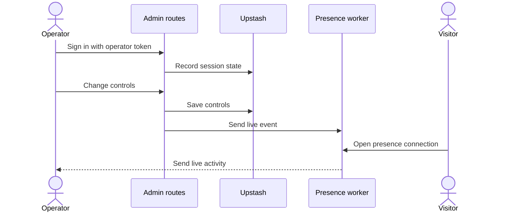

# Operator live operations

## Purpose

This flow lets the operator change live controls and see activity on the admin dashboard.
The optional presence worker sends browser connections and server events to the dashboard.

## Entry points

`POST` in `src/app/api/admin/session/route.ts:48` signs in an operator.
`POST` in `src/app/api/admin/controls/route.ts:37` changes live controls.
`LivePresence` in `src/components/live-presence.tsx:96` opens a visitor connection when configured.

## Sequence

## Key behavior

* `isOperatorConfigured` in `src/server/admin/operator.ts:33` checks that the operator token has a minimum of 32 characters.
* `createAdminSession` in `src/server/admin/operator.ts:88` signs a browser session.
* `verifyAdminRequest` in `src/server/admin/operator.ts:152` checks an operator request.
* The controls route uses `writeControls` and then announces the change with `emitLiveEvent`.
* The `Presence` object in `workers/presence/src/index.ts` holds live connections and a feed of events.

## Failure modes

Sign-in can give an error for missing configuration, an incorrect token, or too many tries.
A controls write can give an error if Redis does not give the new state back.
The live feed is unavailable when the worker URL or shared secret is missing.
The dashboard can use its normal state route when the live worker is missing.
