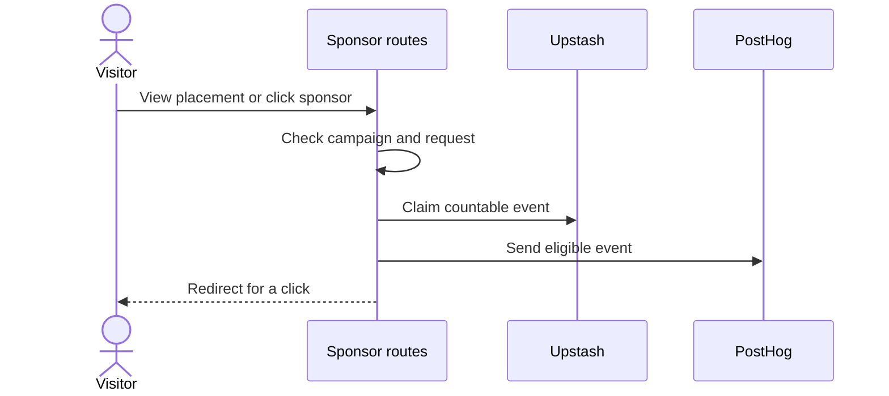

# Sponsor measurement

## Purpose

This flow points a visitor to an approved sponsor destination.
It counts eligible views and clicks when PostHog is configured.

## Entry points

`GET` in `src/app/out/[campaign]/route.ts` processes a sponsor click.
`POST` in `src/app/out/[campaign]/impression/route.ts` accepts a view event.

## Sequence

## Key behavior

* `findSponsorCampaign` in `src/lib/sponsor-campaign.ts` selects only campaigns in source.
* `sponsorDestination` in `src/server/sponsor-clicks.ts:46` selects an approved destination.
* `claimSponsorEvent` in `src/server/sponsor-clicks.ts:165` limits duplicate events or counts above the ceiling.
* `recordSponsorEvent` in `src/server/sponsor-clicks.ts:227` sends eligible events to PostHog.
* A production click on a campaign that is not active goes to the advertise page and does not count.

## Failure modes

An unknown campaign or placement gets a 404 response.
An invalid or cross-origin view request is refused.
No PostHog key means the app does not record the event.
The redirect works if deferred analytics work gives an error.
