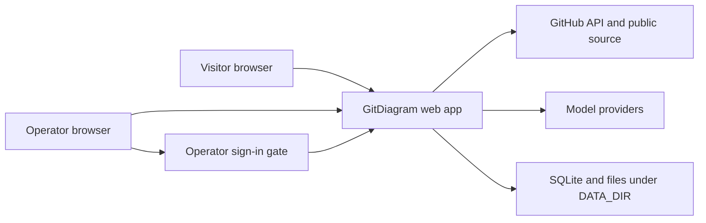

# System overview

GitDiagram makes an architecture diagram for a selected GitHub repository.
The home page accepts a repository, and the repository page shows a saved diagram or starts a new one.
When the two video flags are set, a visitor can also make or see an explainer video.
The operator can pause new videos and read the voice balance on the admin page.
The private fork is a single-operator tool. It has no daily quotas, no per-person budgets, and no location rules.

It operates on an IIS host at `gitdiagram.tuple.pro`. The footer credits the upstream project. See [Deploy to the IIS host](deployment.md) and [ADR 0003](decisions/0003-self-hosted-single-operator.md).

## Users and boundaries

`checkReadiness` in `src/server/readiness.ts:65` checks provider values and a model key before it checks the SQLite database and `DATA_DIR`.
The app saves all diagrams, videos, and locks in `DATA_DIR`.
The operator signs in with `OPERATOR_TOKEN`. SQLite stores session state, a random installation nonce, and the global wrong-token counter.
Video work also uses providers for scripts, voice, and word timing.

## Main paths

- [Diagram generation](flows/diagram-generation.md) reads GitHub data and makes Mermaid output.
- [Artifact storage](flows/artifact-storage.md) saves public and private results on disk.
- [Explainer video](flows/explainer-video.md) makes and renders repository videos.
- [Operator dashboard](flows/operator-live-ops.md) pauses new videos and shows the voice balance.

The [configuration inventory](configuration.md) records the inputs for these paths.
The [audit report](vuln-scan-2026-09-28.md) records outbound destinations and the risks that were open on 2026-09-28.
