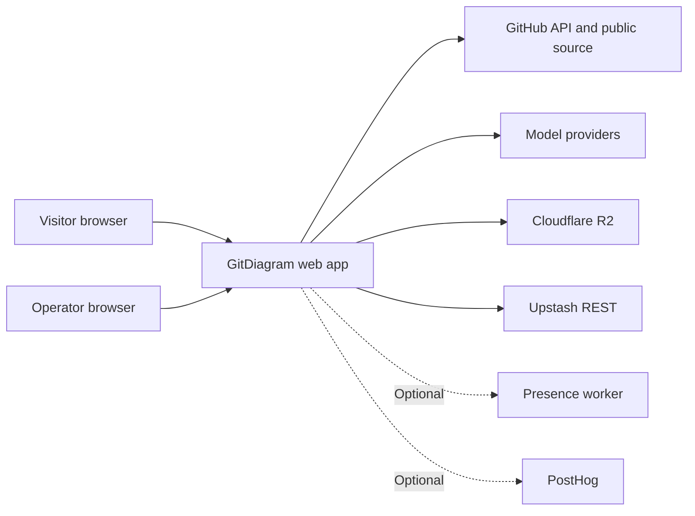

# System overview

GitDiagram makes an architecture diagram for a selected GitHub repository.
The home page accepts a repository, and the repository page shows a saved diagram or starts a new one.
When the two video flags are set, a visitor can also make or see an explainer video.
An operator can control video admission and examine live activity through the admin page.

## Users and boundaries

`checkReadiness` in `src/server/readiness.ts:24` checks a model key, two R2 buckets, and Upstash.
The app uses those services for normal generation and storage.
Video work also uses providers for scripts, voice, and word timing.
The presence worker and PostHog paths operate only if their configuration values are set.

## Main paths

* [Diagram generation](flows/diagram-generation.md) reads GitHub data and makes Mermaid output.
* [Artifact storage](flows/artifact-storage.md) saves public and private results.
* [Explainer video](flows/explainer-video.md) makes and renders repository videos.
* [Operator live operations](flows/operator-live-ops.md) controls admission and live activity.
* [Sponsor measurement](flows/sponsor-measurement.md) records eligible ad events.

The [configuration inventory](configuration.md) records the inputs for these paths.
The [audit report](vuln-scan-2026-09-28.md) records outbound destinations and current risks.
